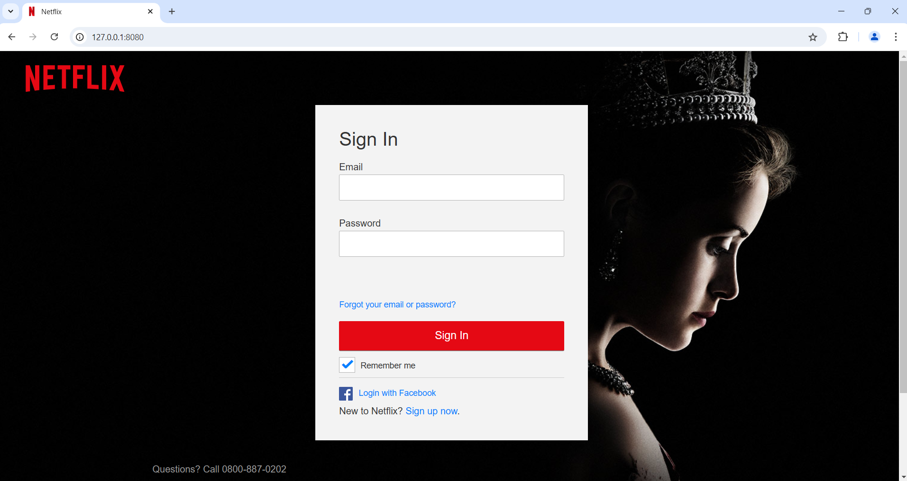

# Summary

This project is part of the Hack-Back movement. The goal is make data obtained through phishing campaigns unusable. It does this by injecting large amounts of bad data into the phishing forms. 

This accomplishes 2 goals
* It makes it harder to utilize the data. Bad actors have to comb through collected data and remove accounts.
* It makes it harder to sell the data. Other criminals are less likely to pay for data that is full of unusable accounts.

# TODO
This project is designed to be quickly understood and modified for the needs of the user. However there are still improvements to be made.
[ ] Improved Error handling
[ ] Automated form finding and filling
[ ] Multiple site handling

# Example Usage

The program is relatively straight forward to use.

```bash
python phishdestroyer.py --help
```
```
usage: PhishDestroyer [-h] [-d DATA] url

A program designed to ruin the databases of phishing attacks. It creates plausibly real people and injects them into a phishing site.

positional arguments:
  url                   the url of the data to submit

options:
  -h, --help            show this help message and exit
  -d DATA, --data DATA  the post data to be submitted. data should be submitted with {f} meaning firstname {l} meaning lastname {u} meaning username {e} meaning email {p} meaning password

```

Assume we came across a phishing site that looks like the following:



Intercepting the traffic and we would see the following request going to `http://127.0.0.1:8080/login.php`

```text
POST /login.php HTTP/1.1
Host: 127.0.0.1:8080
User-Agent: Mozilla/5.0 (Windows NT 10.0; Win64; x64; rv:131.0) Gecko/20100101 Firefox/131.0
Accept: text/html,application/xhtml+xml,application/xml;q=0.9,image/avif,image/webp,image/png,image/svg+xml,*/*;q=0.8
Accept-Language: en-US,en;q=0.5
Accept-Encoding: gzip, deflate, br, zstd
Content-Type: application/x-www-form-urlencoded
Content-Length: 240
Origin: http://127.0.0.1:8080
DNT: 1
Sec-GPC: 1
Connection: keep-alive
Referer: http://127.0.0.1:8080/
Cookie: cL=1730495288693%7C173049528835565804%7C173049528864049349%7C%7C4%7CUNPYKR5TOVFFFKE6OU2YTRLYFY
Upgrade-Insecure-Requests: 1
Sec-Fetch-Dest: document
Sec-Fetch-Mode: navigate
Sec-Fetch-Site: same-origin
Sec-Fetch-User: ?1
Priority: u=0, i

email=asdfm&password=asdfasdf&rememberMe=true&flow=websiteSignUp&mode=login&action=loginAction&withFields=password^%^2CrememberMe^%^2CnextPage^%^2CshowPassword^%^2Cemail&authURL=1529860302635.aNvivY4p^%^2F1hZaoSckbR8cHXao08^%^3D&nextPage=&showPassword=
```

With our program we then attempt to pollute their database:

```bash
python phishdestroyer.py http://127.0.0.1:8080/login.php -d "email={e}&password={p}"
```
```
{'email': '병.Elizbar81@yahoo.com', 'password': '*T&}l}pJ['}
{'email': 'Escarlet.Mkalcha74@yahoo.com', 'password': 'rFx[Zw[f~f13%9'}
{'email': 'Qingran.PeñaBarcia67@gmail.com', 'password': 'eXPensILATionhyrACOTheREMeTHylOLUreadoLLishlY'}
{'email': 'Rambousek_Hajjiri9@hotmail.com', 'password': '64327733'}
{'email': 'UTumundo@yahoo.com', 'password': 'psEudOAmBIdexTrouSLyNonMUnIciPalDEGAMisOcIaList'}
{'email': 'RomannLudia@aol.com', 'password': 'MOBiL12'}
{'email': 'Grunskis.Immerkær@hotmail.com', 'password': 'nORM130'}
{'email': 'ﺩﺭﺩFragakis@gmail.com', 'password': 'cn)a~A9(d<yyF'}
{'email': 'СлободанKissu@outlook.com', 'password': 'sisTErS'}
{'email': 'Cbuda.MontañoHurtado@aol.com', 'password': 'T%];iX|j0,-I.*'}
{'email': 'MSableng@yahoo.com', 'password': '1Z;2Hp_@attB,'}
{'email': 'Märïą_Kecubung@hotmail.com', 'password': 'O!Hk[%u&'}
...
```

On the backend of the phishing server the data is polluted.